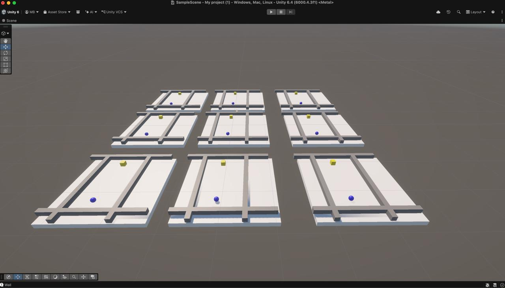
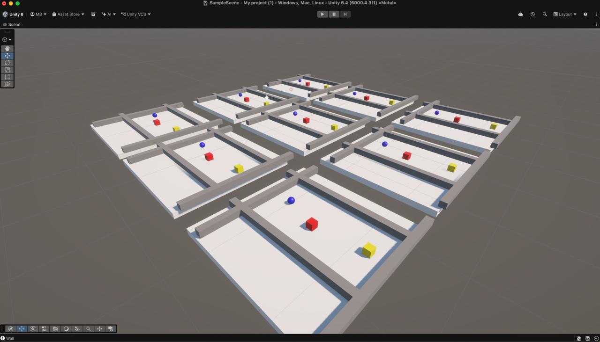
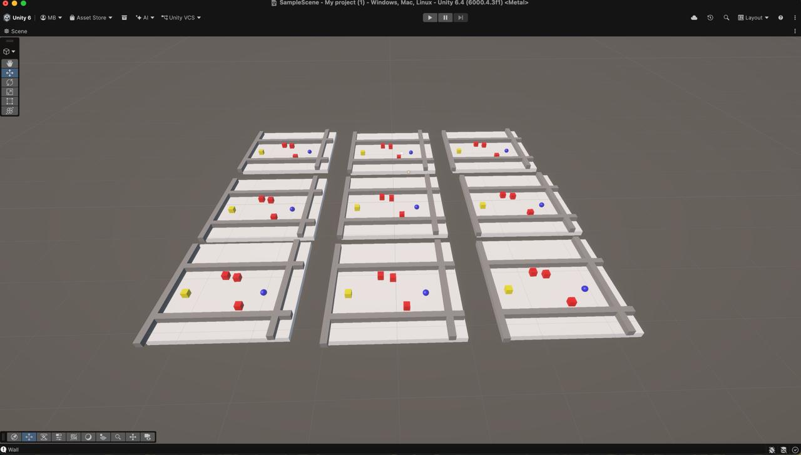

# 3D Obstacle Navigation RL Agent

A simple **reinforcement learning** project in **Unity 3D**. An agent learns to move around obstacles and walls to reach a goal.

Training uses **Unity ML-Agents** with the **PPO** (Proximal Policy Optimization) algorithm.

Blue sphere = agent · Yellow cube = goal · Red cubes = obstacles · Gray boxes = walls

## Environment

The scene runs several copies of the arena at once so the agent can collect more experience per training step.

**Open arena (walls only)**



**One obstacle**



**Three obstacles**



## What the agent does

Each episode:

1. The agent, goal, and obstacles spawn at random positions in a 3D arena.
2. The agent observes its own position, the direction and distance to the goal, and the relative positions of obstacles and walls.
3. It outputs continuous movement on the X and Z axes.
4. It is rewarded for getting closer to the goal, and penalized for hitting obstacles, hitting walls, or running out of time.

**Rewards**

| Event | Reward |
| --- | --- |
| Reaching the goal | `+1` |
| Moving closer to the goal | small positive (distance progress) |
| Time step | `-0.001` (encourages faster paths) |
| Hitting a wall or obstacle | `-1` and episode ends |
| Timeout (40 seconds) | `-0.5` and episode ends |

## Requirements

- [Unity 6](https://unity.com/download) **6000.4.3f1** (or a close 6000.4.x version)
- Python 3.10+
- [Unity ML-Agents](https://github.com/Unity-Technologies/ml-agents) Python package (`mlagents`)

The Unity package `com.unity.ml-agents` is already listed in `Packages/manifest.json`.

## Project layout

```
Assets/Scripts/movetogame.cs   # ML-Agents agent (observations, actions, rewards)
Assets/Scripts/Goal.cs         # Goal object
Assets/Scripts/Wall.cs         # Wall object
Assets/Scenes/SampleScene.unity
Assets/Models/                 # Trained ONNX models used in the editor
Config/config.yaml             # PPO training hyperparameters
pictures/                      # Environment screenshots
results/                       # Training runs (checkpoints, ONNX, logs)
```

## Training runs

Saved trainer output lives under `results/`:

| Run | Notes |
| --- | --- |
| `firstRun` | Early training run |
| `ppo` | PPO baseline |
| `totalRandomeness` | Randomized spawn training |
| `FirstObsModel` | Trained with a single obstacle |
| `ThreeObsModel` | Trained with three obstacles (main setup) |

Each run typically contains `My Behavior/` (ONNX models and checkpoints) and `run_logs/`.

## Setup

1. Clone this repository and open the folder in Unity Hub.
2. Let Unity import packages and open `Assets/Scenes/SampleScene.unity`.
3. Create a Python virtual environment and install ML-Agents:

```bash
python3 -m venv venv
source venv/bin/activate
pip install mlagents
```

## Train

1. Activate the virtual environment.
2. From the project root, start the trainer:

```bash
mlagents-learn Config/config.yaml --run-id=ThreeObsModel
```

3. When the console says it is waiting for the Unity environment, press **Play** in the Unity Editor.

New runs are written under `results/<run-id>/`. Copy an `.onnx` file into `Assets/Models/` and assign it on the agent's **Behavior Parameters** to run inference without the Python trainer.

## Inference

1. Open `SampleScene`.
2. Select the agent and set **Behavior Type** to `Inference Only`.
3. Assign a trained model from `Assets/Models/` (or from `results/`).
4. Press **Play**.

## Training config

`Config/config.yaml` trains behavior `My Behavior` with PPO:

- Batch size: 256
- Buffer size: 4096
- Learning rate: `3e-4`
- Hidden units: 128, 2 layers
- Max steps: 10,000,000

## License

This project is licensed under the MIT License.
You are free to use, modify, and distribute this project, provided that the original copyright notice and license are retained.
